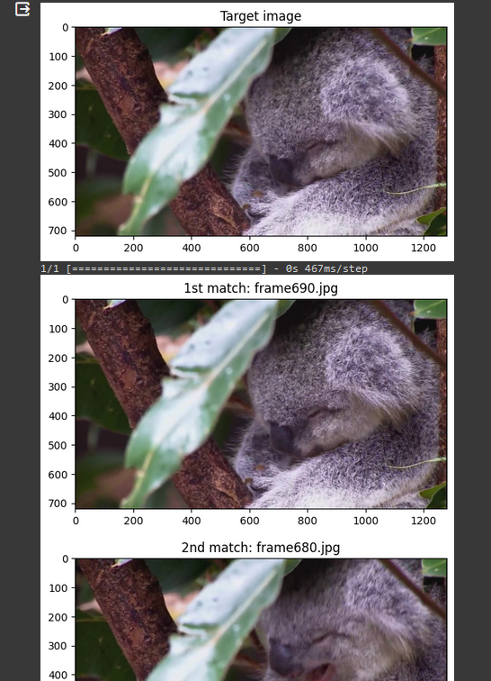
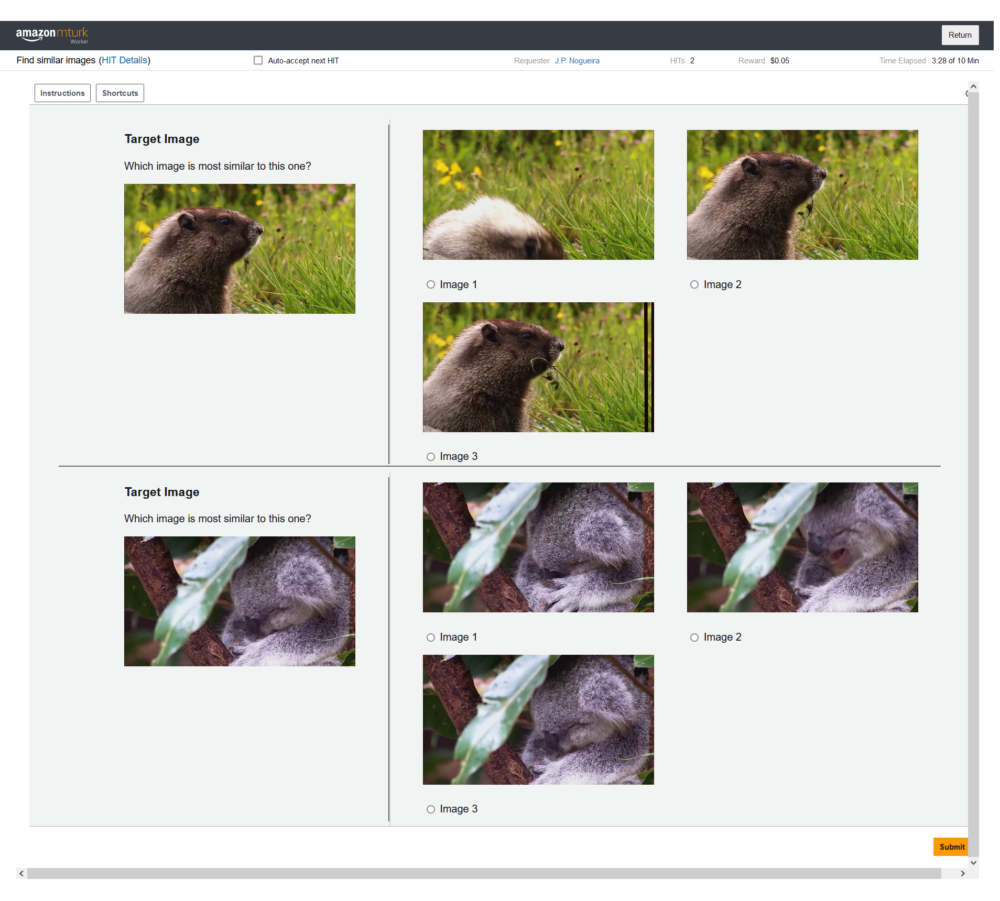
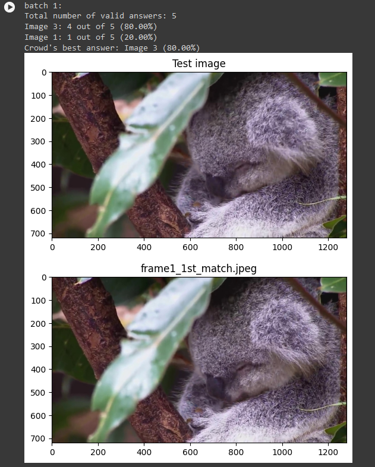
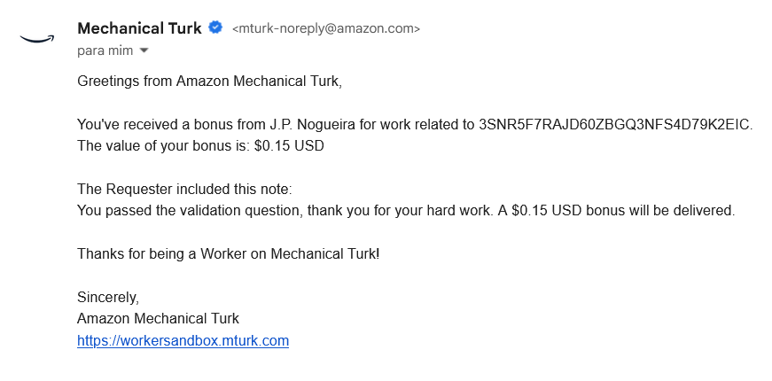

# image-similarity-mturk-pipeline

This solution finds the most similar images in a dataset through a lightweight deep learning workflow, and then validates the results through a crowd with MTurk. 

This project is an extension of [deeplearning-image-similarity](https://github.com/J-Pedro-Nogueira/deeplearning-image-similarity/) and borrows its directory structure and naming conventions.

# Usage

## Execution on Google Colaboratory
 The project is set up to use **Google Colab** to analyze a dataset stored on **Google Drive**, although it can be adapted to run locally.

## Requirements
User must have:

- A **Google** account and access to an image dataset, query images and gold-standard images stored on **Google Drive**.
    - Check the supplied images for reference.
- An **S3 Bucket** that is publicly accessible.
- **AWS** security credentials.
    - The credentials may be input through the console or supplied in a JSON file like so:
    ```
    {
    "aws_key": "YOUR_AWS_KEY",
    "aws_secret_key": "YOUR_SECRET_AWS_KEY"
    }
    ```

## Operation


- The necessary directories and HIT details are specified on the first cell.
- The deep learning solution finds the three images in the dataset most similar to each query image.
- The results are sent to the **S3 Bucket** and are used to construct the HITs.
- Each HIT has 2 questions: 
    - A validation question constructed from a random batch of images in the *knownanswers_directory*.
    - A question constructed from the results of the deeplearning solution.
- If the worker answers the validation question correctly, the worker is paid a bonus and their answer constitutes a vote.
- If the worker answers the validation question incorrectly, the bonus is not paid and their answer is not considered. In any case, the worker is notified accordingly.
- At any time, the user may retrieve the current results from the crowd, which are presented and stored for analysis.

<!-- <br clear="right"/> -->

<br/><br/>
<br/><br/>

## Example Workflow

The most similar images are initially found through the deep learning process:



The images are used to create a question in a HIT (the bottom question) and are paired with a validation question — a question to which the answer is already known (the top question):



The results are gathered from multiple workers and presented to the user:



## Notes

- All workers are notified via e-mail, like so:



- There is a small dataset in the *data* folder ready for a test run. 

- Although not required, it is recommended that the images sent to the **S3 Bucket** follow the naming scheme in the *knownanswers* folder (for every batch of images, the query image is named as *knowni.jpeg*, the correct answer is named as *knowni_1st_match.jpeg*, and the incorrect answers are *knowni_2nd_match.jpeg* and *knowni_3rd_match.jpeg*).


<!--
@startuml GamePlan
skinparam ConditionEndStyle hline
start
:Access dataset;
:Find the 3 most similar images;
:Send results to the crowd;
if (Validation questions answered correctly?) then (yes)
  :Pay the bonus;
  :Answer is considered;
else (no)
  :Do not pay the bonus;
  :Answer is not considered;
endif
:Notify the workers;
:Present the most voted image back to the user;
:Save the results;
stop
@enduml
-->
